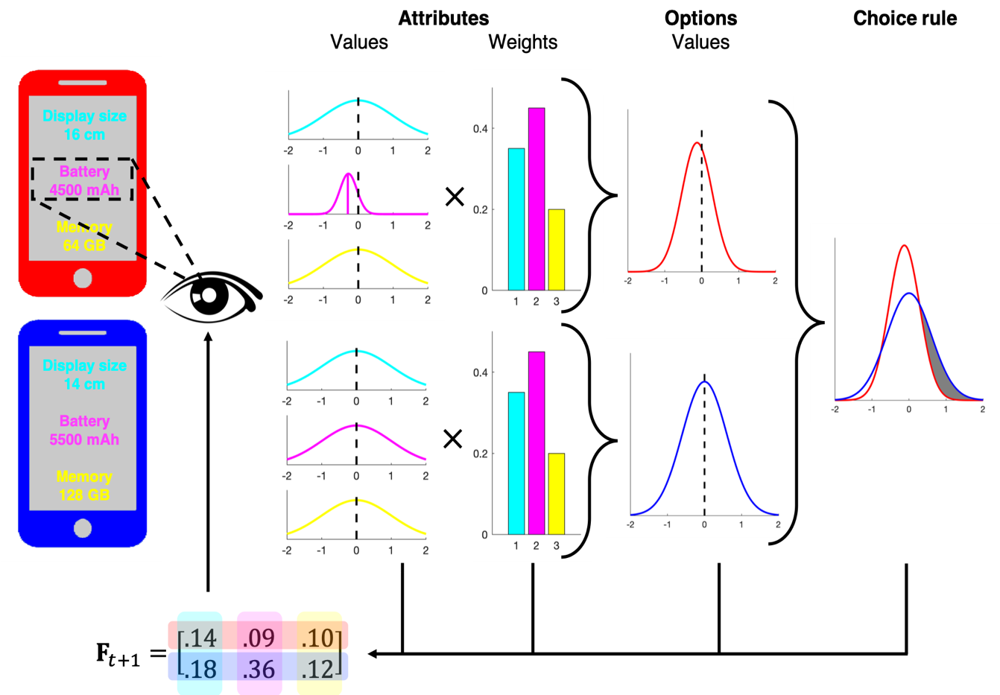

# MASC: Multi-Attribute Search & Choice Model
#### *Sebastian Gluth, Jordan Deakin, Jorg Rieskamp*

MASC is a hierarchical Bayesian model of adaptive information search for decisions between options characterised by multiple attributes. The model predicts the allocation of attention over time, the termination of search and the choice made. 

This repository contains the model code as well as simulation results and data presented in the paper X. 

##### Main Model Functions
- **MASC_Model - Contains the main model code for MASC.
- **MASC_ModelA** - Contains the main model code for the absolute threshold variant of MASC.
- **MASC_Create** - Creates a set of options and parameters.
- **MASC_FitStudy** - Grid search used in manuscript to find best fitting parameters. 
- **MASC_Initialize** - Initialises a simulation of MASC either with real options and parameters (from data) or generates them. 
- **MASC_Example** - An example of how to simulate the model and the inputs the model expects. 
- ./Search_Rules** - This contains the different search rules that can be used with MASC. See MASC_Model for a description. 	MASC_SearchRule_myopic is MASC's default myopic search rule. 
- **./Manuscript** - This contains data and simulation codes used for the MASC manuscript. 

##### Manuscript Folder
###### This folder contains data and simulations used in the manuscript. 
- **runHypothesisTests_Data.m**: Analysis of Hypotheses 1-7 in the manuscript. 
- HypotehsisTests_Data.mat**: This is a structure array of tables containing the results of the statistical analysis of Hypotheses 1-7 presented in the manuscript. It is the output of runHypothesisTests_Data.
- **studyData* files**: These files contain the data from the Phone & Hotel choice tasks presented in the manuscript.
- **./Workspaces**: This contains matlab workspaces containing the fitting results of each of the 10 variants (search rule) of MASC fitted to the the Phone & Hotel datasets.
- Search Rule Simulations: For each search rule there is a .mat file which contains the significance tests for 1000 simulations (Table 1 in the manuscript). The 7 test fields correspond to the 7 hypotheses. 1 denotes an effect was significant and 0 otherwise. 
- **./AppendixB_ParameterRecovery**: Parameter recovery analysis scripts and the recovered parameters presented in the manuscript. 
- **./AppendixC_MultiAlternative**: Contains the results of 1000 simulations of MASC with n = 4, as presented in the manuscript, along with the data (see manuscript for details). 
- **./AppendixE_AbsoluteThreshold**: Contains the significance tests for 1000 simulations of the absolute threshold variant of MASC. The 7 test fields correspond to the 7 hypotheses. 1 denotes an effect was significant and 0 otherwise. 
- **./AccountingForQualitativeEffects**: Contains the functions used to simulate various effects presented in the manuscript (the effect of time pressure, overall value, Hick's law and the relationship between attribute weights and attention. 
